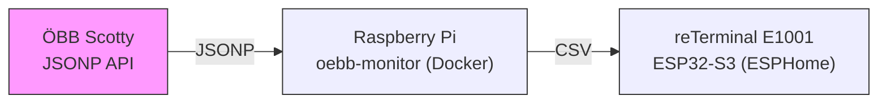

# ePaper Monitor

A self-hosted system that displays live ÖBB (Austrian Federal Railways) departure information on a Waveshare 7.5" e-paper display powered by a Seeed reTerminal E1001 (ESP32-S3).

This repository contains both the server (`oebb-monitor/`) and the ESPHome configuration (`esphome/`). The server component runs on a local Raspberry Pi and is reachable on the local network at:

http://192.168.0.171:5010

## Architecture



**Data flow:**

1. The `oebb-monitor` Go service fetches live departure data from the ÖBB Scotty JSONP API for one or more stations, merges and sorts them, and returns a CSV response (~1 KB).
2. The reTerminal E1001 running ESPHome firmware fetches that CSV over HTTP, parses it on-device, draws the departure table directly on the e-paper display, and goes to deep sleep.

No screenshot service or headless browser involved — the ESP32 draws the table natively.

## Components

| Component | Path | Runs on | Purpose |
|---|---|---|---|
| `oebb-monitor` | `oebb-monitor/` | Raspberry Pi (Docker) | Fetches ÖBB API, returns CSV on port `:5010` |
| `esphome` | `esphome/` | Flashed to ESP32-S3 (reTerminal E1001) | ESPHome firmware for the e-paper device |

## Server Setup (local Raspberry Pi)

The server runs on a Raspberry Pi on the local network and serves the `oebb-monitor` service at:

- Base URL: http://192.168.0.171:5010

This is the address the ESPHome firmware fetches for `/departures.csv`. The service is served over plain HTTP on the LAN. If you change the server address or port, update the ESPHome configuration accordingly.

### Example: access the CSV

```
http://192.168.0.171:5010/departures.csv?stations=1290501:1292001,0905026,1390563&num_journeys=10&additional_time=5&total=10
```

### Running with Docker (on the Pi)

A minimal example Compose service (maps container port 80 to host port 5010):

```yaml
services:
  oebb-monitor:
    image: oebb-monitor:latest
    container_name: oebb-monitor
    ports:
      - 5010:80
    restart: unless-stopped
```

Build and deploy on the Pi (example):

```sh
cd ~/oebb-monitor-v2
docker build -t oebb-monitor:latest .
# Copy image to the Pi or build on the Pi and then:
cd /opt/stacks/oebb-monitor
docker compose up -d --force-recreate
```

If you prefer to run the compiled binary directly on the Pi, run it bound to port `5010` (adjust paths and permissions as necessary).

## oebb-monitor — `/departures.csv`

A single Go binary that fetches departures from one or more ÖBB stations and returns a merged, sorted CSV. Designed to be consumed directly by the ESP32.

### Query Parameters

| Parameter | Default | Description |
|---|---|---|
| `stations` | *(required)* | Comma-separated list of ÖBB station IDs. Optional direction filter(s) per station via colon: `stationId:dir1:dir2` |
| `num_journeys` | `6` | Number of departures to fetch per station |
| `additional_time` | `0` | Lead time in minutes (skip departures sooner than this) |
| `total` | `12` | Maximum rows in the merged result |
| `products_filter` | `1011111111011` | ÖBB product bitmask filter |

### CSV Format

The response is `text/csv; charset=utf-8`. The first row contains the current server time (Europe/Vienna) in the first column, followed by column headers. Data rows follow, sorted by departure time.

```
21:12,Linie,Von,Richtung
21:17,S 3,Matzl Pl.,Floridsdorf Bhf
21:19,Bus 14A,Spengerg.,Neubaug. (Schadekg.)
21:20,S 1,Matzl Pl.,Gänserndorf Bhf
```

| Column | Content |
|---|---|
| **Zeit** | Actual departure time (real-time if delayed, scheduled if on time) |
| **Linie** | Line name (e.g. `REX 1`, `Tram 18`, `S 2`, `Bus B01`) |
| **Von** | Departure station name (shortened) |
| **Richtung** | Direction / terminal station (shortened) |

Cancelled departures (`Ausfall`) are filtered out. Station and direction names are shortened (e.g. "Wien Matzleinsdorfer Platz" → "Matzl Pl."). HTML entities from the API are decoded.

## ESPHome — reTerminal E1001

The ESP32-S3 based device runs ESPHome firmware that fetches the CSV and draws the departure table natively on the e-paper display.


### Display & Behavior (summary)

- Model: Waveshare 7.5" e-paper V2 (`7.50inV2p`), 800×480 pixels, black & white
- Draws a 4-column table (Zeit, Linie, Von, Richtung)
- Shows server time, battery, temperature, and departures
- Deep sleep behavior to conserve power; wakes on schedule or button press

### Flashing

Example (local machine):

```sh
esphome run --device /dev/cu.wchusbserial10 esphome/config/reterminal-e1001.yaml
```

(Adjust device path and filename as needed.)
