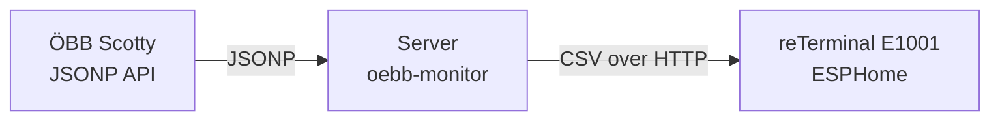

# ePaper Monitor (ÖBB Departures)

A self-hosted system that renders live ÖBB (Austrian Federal Railways) departure boards on a Waveshare 7.5" e-paper display driven by a Seeed reTerminal E1001 (ESP32‑S3).

The repository contains:
- `oebb-monitor/`: a lightweight Go HTTP service that fetches and normalizes departure data from the ÖBB Scotty (JSONP) API and exposes it as CSV
- `esphome/`: ESPHome firmware configuration for the e-paper device that fetches the CSV and draws the table directly on-device

## Architecture



### Data flow
1. `oebb-monitor` fetches departures for one or more stations, merges and sorts them, and returns a small CSV response.
2. The ESP32 fetches the CSV, parses it, renders the departure table to the e-paper display, then enters deep sleep.

No headless browser or screenshot rendering is used—the ESP32 draws everything natively.

## HTTP API

### `GET /departures.csv`

Returns `text/csv; charset=utf-8`.

#### Query parameters

| Parameter | Default | Description |
|---|---:|---|
| `stations` | *(required)* | Comma-separated list of station selectors: `stationId` or `stationId:dirId1:dirId2,...` (direction filters are optional). Example: `208100002,8100108:1180207:8100002`. Station/direction IDs can be sourced from https://dave2ooo.github.io/oebb-link-creator/html/mode1.html. |
| `num_journeys` | `6` | Departures to fetch per station. |
| `additional_time` | `0` | Lead time in minutes; departures sooner than this are skipped. |
| `total` | `12` | Maximum rows in the merged result. |
| `products_filter` | `1011111111011` | ÖBB product bitmask filter. |

#### Example

```text
example.com/departures.csv?stations=208100002,8100108:1180207:8100002&num_journeys=10&additional_time=5&total=10
```

#### CSV format

The first row contains the server time (Europe/Vienna) in the first column, followed by column headers. Data rows follow, sorted by departure time.

```csv
21:12,Linie,Von,Richtung
21:17,S 3,Matzl Pl.,Floridsdorf Bhf
21:19,Bus 14A,Spengerg.,Neubaug. (Schadekg.)
21:20,S 1,Matzl Pl.,Gänserndorf Bhf
```

Columns:
- **Zeit**: actual departure time (real-time if delayed, scheduled if on time)
- **Linie**: line name (e.g. `REX 1`, `Tram 18`, `S 2`, `Bus 14A`)
- **Von**: departure station name (shortened)
- **Richtung**: direction/terminal (shortened)

Notes:
- cancelled departures (`Ausfall`) are filtered out
- names are shortened for display
- HTML entities from the upstream API are decoded

## Deployment

### `oebb-monitor` (server)

`oebb-monitor` can be run as a container or as a standalone binary. It must be reachable by the ESPHome device over HTTP.

Minimal Docker Compose example (maps container port 80 to host port 5010):

```yaml
services:
  oebb-monitor:
    image: oebb-monitor:latest
    container_name: oebb-monitor
    ports:
      - "5010:80"
    restart: unless-stopped
```

### ESPHome (device)

The device periodically fetches `/departures.csv`, renders the table, and enters deep sleep to conserve power.

Display summary:
- Waveshare 7.5" e-paper V2 (`7.50inV2p`), 800×480, black & white
- renders a 4-column table (Zeit, Linie, Von, Richtung)
- shows server time plus device metrics (battery/temperature, depending on configuration)

Flashing example:

```sh
esphome run --device /dev/<serial-device> esphome/config/reterminal-e1001.yaml
```

## Repository layout

```text
epaper-monitor/
  esphome/        # ESPHome firmware configuration
  oebb-monitor/   # Go service that exposes /departures.csv
  readme.md
```
